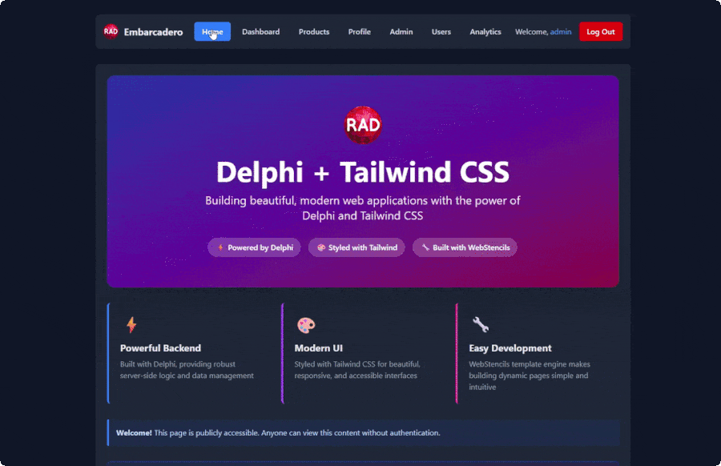

# Delphi + Tailwind CSS Demo



A demonstration project showing how to integrate **Tailwind CSS** with **Delphi** web applications using **WebStencils** and **WebBroker**. This project demonstrates a workflow for using modern CSS frameworks in Delphi projects without requiring Node.js.

**Note**: All data in this demo is mock data. The main purpose is to demonstrate the Tailwind CSS workflow with Delphi, not to showcase a production-ready application.

The application includes a basic mock authentication mechanism (`demo/demo123` for user role, `admin/admin123` for admin role).

## What Makes This Unique?

This project uses a hybrid approach that switches between CDN and local CSS based on build configuration:

- **No Node.js Required**: Uses Tailwind's standalone CLI binary
- **Hybrid Workflow**: CDN for development, optimized CSS for production
- **Delphi Integration**: Post-build events automatically generate optimized CSS
- **Zero Runtime Dependencies**

## Prerequisites

- **Delphi** (any recent version with WebBroker support)
- **WebStencils** library (for template rendering)
- **Tailwind CSS Standalone CLI** (download separately)

## Quick Start

### 1. Download Tailwind CSS CLI

The Tailwind CLI binary is not included in this repository. Download it separately:

1. Visit [Tailwind CSS Releases](https://github.com/tailwindlabs/tailwindcss/releases/latest)
2. Download `tailwindcss-windows-x64.exe` (or appropriate for your platform)
3. Rename to `tailwindcss.exe` and place in the `tools/` directory

### 2. Build and Run

The post-build event is already configured in this project. It automatically runs `build-tailwind.bat` during Release builds to generate optimized CSS. In Debug mode, the application uses the Tailwind CDN instead.

- **Debug Mode**: Uses Tailwind CDN (no build step needed)
- **Release Mode**: Post-build generates optimized `output.css` (typically 5-50KB vs 3-4MB)

Run the application and open `http://localhost:8080`

## Project Structure

```
TailwindCSS/
├── tools/
│   ├── tailwindcss.exe          # Download separately
│   └── tailwind.config.js
├── src/
│   └── input.css
├── templates/                   # WebStencils templates
│   ├── baseLayout.html          # Conditional CSS loading
│   ├── partials/                # Reusable components
│   └── static/css/
│       └── output.css           # Generated (gitignored)
├── Module.Main.pas              # Web module
├── Models.pas                   # Data models
├── Utils.MockData.pas           # Mock data generators
└── build-tailwind.bat
```

## How It Works

### Conditional CSS Loading

The `baseLayout.html` template switches between CDN and local CSS based on build configuration:

```html
@if (env.debug) {
  <script src="https://cdn.jsdelivr.net/npm/@tailwindcss/browser@4"></script>
} @else {
  <link rel="stylesheet" href="/static/css/output.css">
}
```

The `env.debug` variable is set in `Module.Main.pas` based on `{$IFDEF DEBUG}`.

### Dark Mode

The application automatically detects the operating system's dark/light mode preference and applies the appropriate theme. Tailwind's dark mode classes are used throughout the templates to support both themes.

### Data Flow

1. Mock data is generated in `InitMockData()` during `WebModuleCreate`
2. Data is added to `WSEngine` and available to all templates
3. Templates use WebStencils syntax to render HTML with Tailwind classes
4. Browser receives fully styled HTML

### Route Handling

The WebStencils engine automatically routes requests to matching template files. Mock data is pre-loaded at startup, so templates can access it directly.

## Configuration

### Post-Build Event

The project is already configured with a post-build event that runs `build-tailwind.bat` during Release builds. The post-build event is set to only run in Release mode (Debug mode uses the CDN). To view or modify it, go to **Project Options** → **Build Events** → **Post-build events**.

### Tailwind Config

Edit `tools/tailwind.config.js` to customize Tailwind behavior. If you generate Tailwind classes dynamically in Delphi code, add them to the `safelist` array.

### Build Script

The `build-tailwind.bat` script runs Tailwind CLI:

```batch
tools\tailwindcss.exe -i src\input.css -o templates\static\css\output.css --minify --content "templates\**\*.html"
```

## Troubleshooting

- **CSS not generating**: Check that `tools/tailwindcss.exe` exists and run `build-tailwind.bat` manually
- **Classes missing**: Verify `tailwind.config.js` content paths and rebuild CSS
- **Build event not running**: Ensure it's configured for Release mode only
- **CDN not loading**: Check that `env.debug` is `'True'` in Debug builds

## Additional Resources

- **Tailwind CSS Documentation**: [tailwindcss.com](https://tailwindcss.com)
- **Tailwind CLI Releases**: [GitHub Releases](https://github.com/tailwindlabs/tailwindcss/releases)

---

This technique demonstrates that Delphi can be used with modern CSS frameworks without Node.js or complex JavaScript tooling. The hybrid CDN/local approach provides fast development iteration and optimized production builds.
