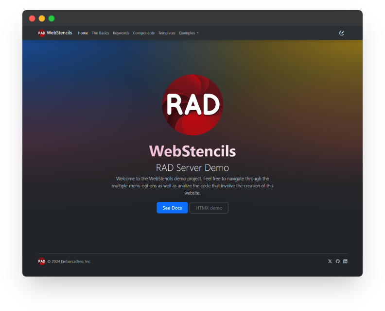

# WebStencils Demo - RAD Server Project (Delphi)

## 🌟 Overview 
This project demonstrates using WebStencils with RAD Server in Delphi. It serves the same website content as the WebBroker demos but utilizes RAD Server's REST API architecture and an InterBase database.

## 🚦 Getting Started
RAD Server requires absolute paths for resources. Before running:
1.  **Open `WebResource.pas`**. 
2.  Locate the `DataModuleCreate` event handler.
3.  **Update the `LProjectPath` constant** to the absolute path of the *project directory* on your machine (e.g., `C:\Path\To\WebStencilsDemos\RADServerProject\Delphi`). This ensures the server can find the shared templates and the InterBase database.
4.  Run the RAD Server development server (`EMSDevServer.exe`) and ensure the project's BPL is loaded.
5.  Open a browser and access `http://localhost:8080/web`

**IMPORTANT**: The `codeBlock` snippet in the docs includes a `copy` button. Due to browser security, this only works when accessing via `localhost` or HTTPS.
> _This project has been tested on Windows._

## 📚 Examples 
### Docs 
Most menus explain WebStencils usage and templating patterns.

### Customers (Big Table & Pagination)
Loads customer data from the `CUSTOMERS` table in the shared InterBase database (`resources/data/tasks.ib`). Demonstrates both loading all customers (Big Table) and server-side pagination.

### To-Do app - HTMX Integration
Loads and manages tasks from the `TASKS` table in the shared InterBase database (`resources/data/tasks.ib`). Uses HTMX with WebStencils for dynamic updates. See `partials/tasks` and related Delphi code (`Controller.Tasks.pas`, `Model.Tasks.pas`).

## 📁 Project Structure 
1.  Delphi units (`.pas`)
2.  InterBase database (`tasks.ib`) in `resources/data`
3.  HTML templates (`.html`) in `resources/html`
4.  Static assets (CSS, JS, images) in `resources/static`

### 🔑 Key Delphi Units
- `WebStencilsRADServerDemo.dpr`: Main project file.
- `WebResource.pas`: RAD Server resource unit handling endpoints, request processing, and WebStencils integration.
- `Model.Tasks.pas`, `Controller.Tasks.pas`: Implement Tasks demo functionality (InterBase backend).
- `Controller.Customers.pas`: Implements Customers demo functionality (InterBase backend).
- `Model.PaginationParams.pas`: Defines a reusable pagination parameter class.
- `CodeExamplesU.pas`: Contains code snippets for documentation pages.

### 📄 HTML Templates
Located in the `resources/html` directory, demonstrating WebStencils templating capabilities.
- `layouts/mainLayout.html`: Main layout.
- Various content pages (e.g., `home.html`, `basics.html`).
- Reusable partials in `partials/`.
- `partials/customers`: Templates for Big Table and Pagination demos.
- `partials/tasks`: Templates for the HTMX Tasks demo.

## 💻 Web Tech Used
- Bootstrap 5.3
- Bootstrap icons
- HTMX 2.0.2 (with JSON-enc extension)
- Minor custom CSS/JS (in `resources/static`)

Dependencies are loaded via CDNs.

## ✨ Environment Variables & Data Sources
- `WebResource.pas` shows how to pass environment-like data (`FEnv`) to the WebStencils engine.
- **Data Sources:** This project uses an InterBase database (`resources/data/tasks.ib`) for both Tasks and Customer data, showcasing WebStencils' integration with different database systems via FireDAC within RAD Server.
